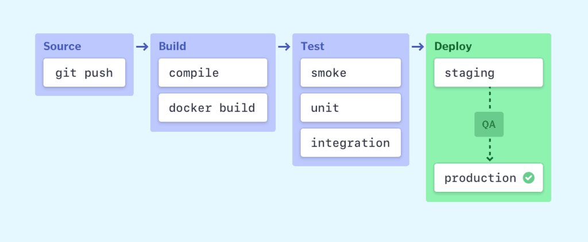
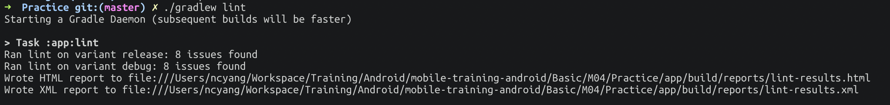
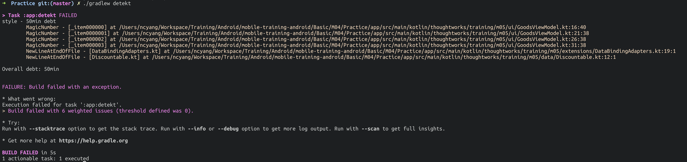
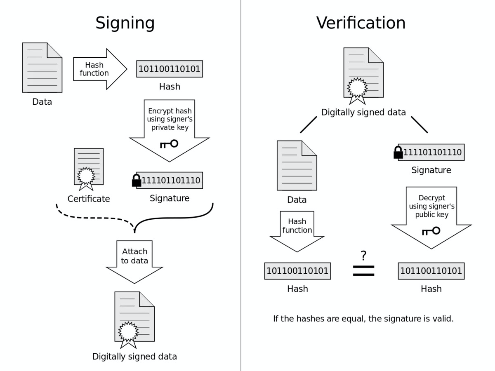
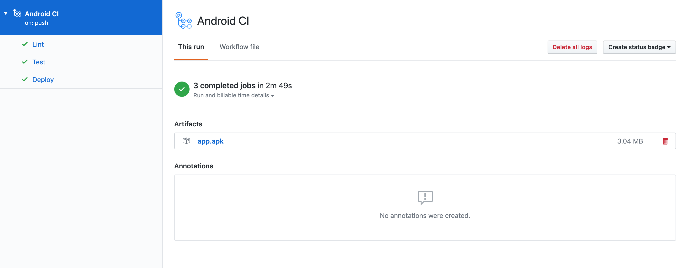
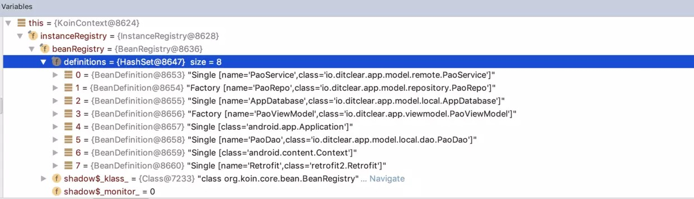
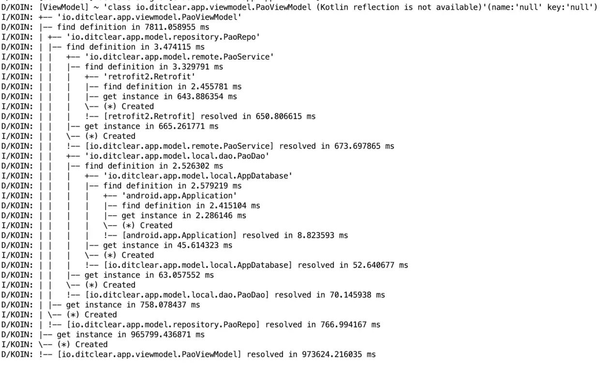
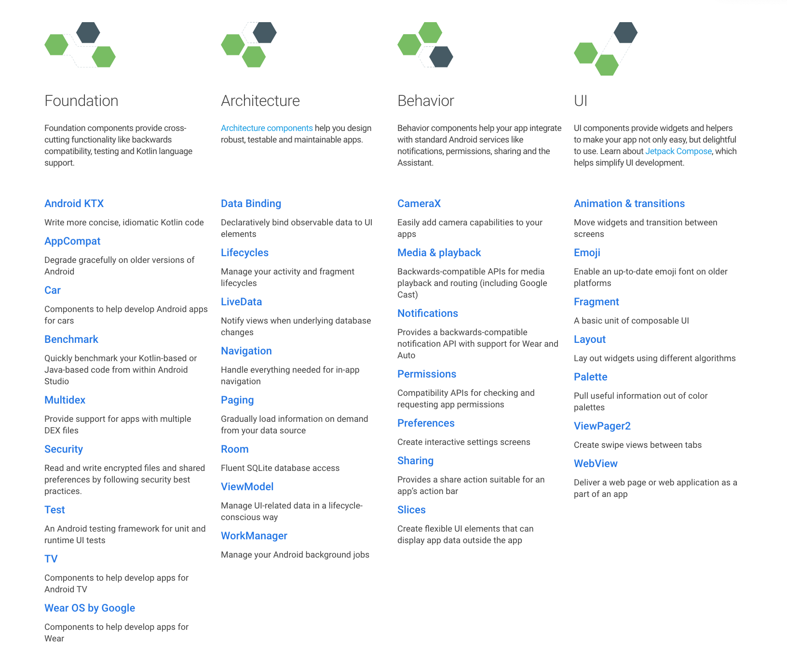
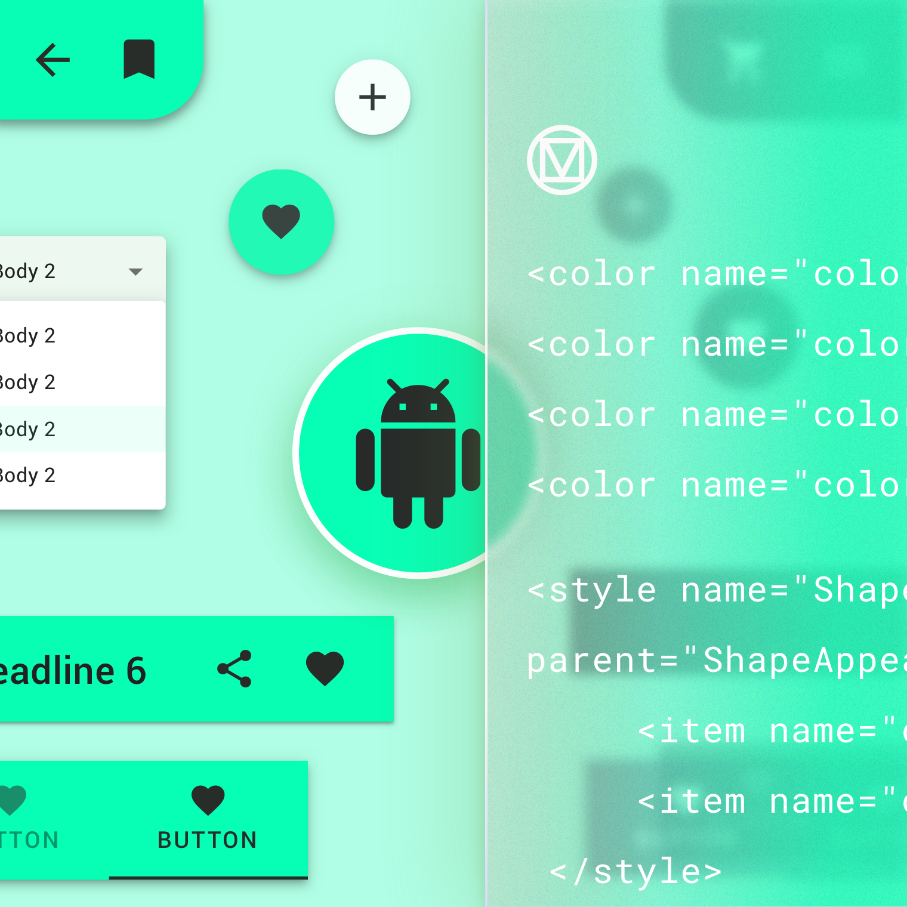

# CI, Release

Continuous integration systems let you automatically build and test your app every time you check in updates to your source control system. You can use any continuous integration tool that can initiate a **Gradle** build to build your Android Studio projects.


## CI/CD



### Code quality assurance

The first step of CI is to make sure code quality, we usually involve some static code analysis tools(*eg. lint*) and code style check tools (*eg. detekt*).

#### Lint

**[Lint](https://developer.android.com/studio/write/lint)** is official recommanded and supporting tool, we could use `./gradlew lint` to help find poorly structured code that can impact the reliability and efficiency of your Android apps and make your code harder to maintain.

##### Configure lint in `build.gradle`

```groovy
android {
    lintOptions {
        abortOnError false
        textOutput 'stdout'
        xmlReport false
        xmlOutput file("lint-report.xml")
        htmlReport true
        htmlOutput file("lint-report.html")
        fatal 'NewApi', 'InlineApi'
        error 'Wakelock', 'TextViewEdits'
        warning 'ResourceAsColor'
		// ...
    }
}
```



#### Detekt

**[Detekt](https://github.com/detekt/detekt)** helps to static code analysis for Kotlin file, including code smell, complexity, etc.

Run detekt via `./gradlew detekt`.



### Unit Test

We could use `./greadlew test` task group to run tests in project.

#### Business Test 

Since we alreay learned project structure, we could easily create unit tests for business layer, *eg. Presenter in MVP, ViewModel in MVVM*. It's same as Java unit test rule, which are compiled to run locally on the Java vertual machine. If your tests depend on objects in the Android framework, we recommend using mock tools (*eg. [Mockito](https://site.mockito.org/), [Mockito-Kotlin](https://github.com/nhaarman/mockito-kotlin), [Robolectric](http://robolectric.org/)*). For tests that depend on your own dependencies, use mock objects to emulate your dependencies' behavior.

#### Automation Test

Unit tests that run on an Android device or emulator. These tests have access to instrumentation information, such as the `Context` for the app under test. Use this approach to run unit tests that have complex Android dependencies that require a more robust environment, such as Robolectric.

On CI, we need to find cloud platform to run automation test, *eg. [Firebase test lab](https://firebase.google.com/docs/test-lab/?gclid=Cj0KCQjwn7j2BRDrARIsAHJkxmw58026442vxnkZvyAE1LsOnhiXIw1C1_5H0c9EJf5deftdeXAhzW0aAvgNEALw_wcB)*, which could test app on many popular Android devices and device configurations (locale, orientation, screen size, and platform version). 

### Continuous Release

During the daily delivery process, we need to publish the latest code to internal application distribution platform in real time, so QA could verify business requirements on time. The output of Android is apk or app bundle, we need to use cloud service to publish it, *eg. AWS*. Or we could also use third party distribution center, *eg. [Firebase App Distribution](https://firebase.google.com/products/app-distribution?gclid=Cj0KCQjwn7j2BRDrARIsAHJkxmxtgrql3KKWWoVWxZg1eLorfmb2dz5TZhlH9XVSo7kF7fJqKjPCVasaAoqIEALw_wcB)*.

### Continuous Deployment

> [Fastlane](https://fastlane.tools/) is an open source platform aimed at simplifying Android and iOS deployment.
> *fastlane* lets you automate every aspect of your development and release workflow.

#### Key signing



The Android release deployment process requires a key to sign off the production build before it moves to the Google Play store. **Keeping keys and passwords on VCS is bad practice**, because VCS is available to any member with access to the project, which includes any temporary 3rd parties. It’s common practice therefore to create release builds on a local computer, but this erodes one of the great advantages to Continuous Delivery: having a scalable online platform and the ability to easily deploy any stages of the CI at any time.


Because of the need to secure the signing keys of the app, building Continuous Delivery for mobile development can be tricky. For Android app development, you could improve security further by using the new **[Google Play App Signing](https://support.google.com/googleplay/android-developer/answer/7384423?hl=en)**, which applies a second key when it is uploaded to the **Google Play Store**. But even after employing this method, there will still be at least a key and a couple of passwords required to build a release (signing key, key and upload password). The CI system needs these to build an APK ready for release, but as mentioned it’s not a good idea to put them on the Version Control. However, using **Encrypted Cloud Storage**(*eg. AWS's KMS*) services is one solution to this problem; they can keep the keys safe and are only limited by the integration capabilities of your chosen CI system.

## Homework

- Build CI using Github Actions for any project you like
- CI should contain
  - lint check
  - test
  - build apk
- Other people could download apk from Artifacts



## Further Reading

### CI Tools

- Android CI - https://source.android.com/setup/build/dashboard
- TeamCity
- Travis CI
- Jenkins
- Bamboo
- GitLab CI
- CircleCI
- BuildKite

### Project build tools

- fastlane - <https://fastlane.tools/>

### Cloud service + Containers

- AWS
- 阿里云
- 腾讯云
- Docker

### Others

- Sign your app - https://developer.android.com/studio/publish/app-signing


# Libraries

There are a lot of popular Android libraries to help developers build better apps. Use better wheel to build better app, lets see what kind of libraries could help us.

>  **R8 / PROGUARD**
>
> In Android, when we add new library dependencies, we need to configure proguard/R8 rules for release build.

## Network

### [OkHttp](https://square.github.io/okhttp/)

[OkHttp](https://goo.gl/ZPX7X4) is an modern, fast and efficient Http client which supports [HTTP/2 ](https://en.wikipedia.org/wiki/HTTP/2)and [SPDY](https://en.wikipedia.org/wiki/SPDY) and sits on top of Okio. [Reading how many things](http://square.github.io/okhttp/) OkHttp does it’s a good way to understand how hard is to do networking: Connection pooling, gziping, caching, recovers from network problems, sync and async calls, redirects, retries … and so on.

OkHttp works on Android 5.0+ (API level 21+) and on Java 8+.

OkHttp depends on [Okio](https://github.com/square/okio) for high-performance I/O and the [Kotlin standard library](https://kotlinlang.org/). Both are small libraries with strong backward-compatibility.

> Okio - a library that complements java.io and java.nio to make it much easier to access, store, and process your data. It provides fast I/O and resizable buffers.

#### Dependency in [Maven Central](https://search.maven.org/artifact/com.squareup.okhttp3/okhttp/4.7.2/jar)

```groovy
implementation("com.squareup.okhttp3:okhttp:4.7.2")
```

#### [Retrofit](https://square.github.io/retrofit/)

A type-safe HTTP client for Android and Java

### [Volley](https://developer.android.com/training/volley)

[Volley ](https://developer.android.com/training/volley/index.html)is a library that acts as an http client, REST helper and image loader. Takes care of requesting, loading, caching, threading, synchronization and some more stuff. It’s ready to deal with [JSON](http://www.json.org/), images, raw text and allow some customization. Volley is available on [GitHub](https://github.com/google/volley).

#### Dependency [release history](https://github.com/google/volley/releases)

```groovy
    implementation 'com.android.volley:volley:1.1.1'
```

### [Cronet](<https://developer.android.com/guide/topics/connectivity/cronet/start>)

Cronet is the Chromium network stack made available to Android apps as a library. Cronet takes advantage of multiple technologies that reduce the latency and increase the throughput of the network requests that your app needs to work.

#### Features

- Cronet natively supports the [HTTP](https://tools.ietf.org/html/rfc2616), [HTTP/2](https://tools.ietf.org/html/rfc7540), and [QUIC](https://www.chromium.org/quic) protocols.
- The library allows you to set a priority tag for the requests. The server can use the priority tag to determine the order in which to handle the requests.
- Cronet can use an in-memory or disk cache to store resources retrieved in network requests. Subsequent requests are served from the cache automatically.
- Network requests issued using the Cronet Library are asynchronous by default. Your worker threads aren't blocked while waiting for the request to come back.
- Cronet supports data compression using the Brotli Compressed Data Format.

#### Dependency

```groovy
implementation 'com.google.android.gms:play-services-cronet:16.0.0'
```

## Image Loader

### [Picasso](https://square.github.io/picasso/)

A powerful image downloading and caching library for Android.

#### Features

- Adapter re-use is automatically detected and the previous download canceled.
- Transform images to better fit into layouts and to reduce memory size.
- Picasso supports both download and error placeholders as optional features.
- Resources, assets, files, content providers are all supported as image sources.
- For development you can enable the display of a colored ribbon which indicates the image source. Call `setIndicatorsEnabled(true)` on the Picasso instance.

#### Dependency [release history](https://github.com/square/picasso/releases)

```
implementation 'com.squareup.picasso:picasso:(insert latest version)'
```

### [Glide](https://bumptech.github.io/glide/)

Glide is a fast and efficient image loading library for Android focused on smooth scrolling. Glide offers an easy to use API, a performant and extensible resource decoding pipeline and automatic resource pooling.

#### Dependency

```groovy
implementation ("com.github.bumptech.glide:glide:4.11.0")
```

### [Coil](https://coil-kt.github.io/coil/)

An image loading library for Android backed by Kotlin Coroutines. Coil is:

- **Fast**: Coil performs a number of optimizations including memory and disk caching, downsampling the image in memory, re-using Bitmaps, automatically pausing/cancelling requests, and more.
- **Lightweight**: Coil adds ~2000 methods to your APK (for apps that already use OkHttp and Coroutines), which is comparable to Picasso and significantly less than Glide and Fresco.
- **Easy to use**: Coil's API leverages Kotlin's language features for simplicity and minimal boilerplate.
- **Modern**: Coil is Kotlin-first and uses modern libraries including Coroutines, OkHttp, Okio, and AndroidX Lifecycles.

#### Dependency

```groovy
implementation("io.coil-kt:coil:0.11.0")
```

## Framework

### DI

#### [Dagger2](https://dagger.dev/)

Dagger is a fully static, compile-time [dependency injection](http://en.wikipedia.org/wiki/Dependency_injection) framework for both Java and Android. It is an adaptation of an earlier version [created](https://github.com/square/dagger) by [Square](http://square.github.io/) and now maintained by Google.

##### Pros

- pure Java
- stable, flexible, powerful
- no runtime error
- fast in runtime

##### Cons

- compile overhead
- hard to learn

##### Dependency

```
dependencies {
  implementation 'com.google.dagger:dagger-android:2.x'
  implementation 'com.google.dagger:dagger-android-support:2.x' // if you use the support libraries
  annotationProcessor 'com.google.dagger:dagger-android-processor:2.x'
}
```

#### [Koin](https://insert-koin.io/)

A pragmatic lightweight dependency injection framework for Kotlin developers. Written in pure Kotlin using functional resolution only: no proxy, no code generation, no reflection!

Koin is a DSL, a lightweight container and a pragmatic API.

##### Pros

- no annotation processing
- easy to learn/setup

##### Cons

- hard to replace/remove
- test in its env
- error in runtime





##### Dependency

```groovy
// Add Jcenter to your repositories if needed
repositories {
    jcenter()
}
dependencies {
    // Koin for Kotlin apps
    implementation "org.koin:koin-core:$koin_version"
    // Koin for Android
    implementation "org.koin:koin-android:$koin_version"
    // Koin for lifecycle scoping
    implementation "org.koin:koin-android-scope:$koin_version"
    // Koin for Android architecture ViewModel
    implementation "org.koin:koin-android-viewmodel:$koin_version"
    // Testing
    testImplementation "org.koin:koin-test:$koin_version"
}
```

### View Injection

#### [ButterKnife](https://github.com/JakeWharton/butterknife) [deprecated]

Field and method binding for Android views which uses annotation processing to generate boilerplate code for you.

```kotlin
@BindView(R.id.text)
lateinit var text: TextView

override fun onCreateView() {
    ButterKnife.bind(this)
}
```

 ##### Dependency

```groovy
android {
  ...
  // Butterknife requires Java 8.
  compileOptions {
    sourceCompatibility JavaVersion.VERSION_1_8
    targetCompatibility JavaVersion.VERSION_1_8
  }
}

dependencies {
  implementation 'com.jakewharton:butterknife:10.2.1'
  annotationProcessor 'com.jakewharton:butterknife-compiler:10.2.1'
}
```

### Platform libraries

#### [Jetpack](https://developer.android.com/jetpack)

Jetpack is a suite of libraries, tools, and guidance to help developers write high-quality apps more easily. These components help you follow best practices, free you from writing boilerplate code, and simplify complex tasks, so you can focus on the code you care about.

Jetpack comprises the [androidx.*](https://developer.android.com/jetpack/androidx) package libraries, unbundled from the platform APIs. This means that it offers backward compatibility and is updated more frequently than the Android platform, making sure you always have access to the latest and greatest versions of the Jetpack components.



#### [Material Components](<https://material.io/develop/android/docs/getting-started/>)

Build beautiful, usable products using Material Components for Android.




``````groovy
implementation 'com.google.android.material:material:<version>'
``````

## Reactive Programming

### [RxJava](https://github.com/ReactiveX/RxJava)

RxJava – Reactive Extensions for the JVM – a library for composing asynchronous and event-based programs using observable sequences for the Java VM.

#### Advantages

- Avoid the [Callback Hell](https://www.quora.com/What-is-callback-hell).
- Threading is a hundred times easier.
- Asynchronous operations becomes way easier using RxJava.
- UI and View-Handling.
- A standard error handling mechanism.
- RxJava has a lot, literally, a lot of operators for your use.
- Functional Reactive Programming

#### Dependency

[](https://maven-badges.herokuapp.com/maven-central/io.reactivex.rxjava3/rxjava)

```groovy
implementation "io.reactivex.rxjava3:rxjava:3.x.y"
implementation 'io.reactivex.rxjava3:rxandroid:3.0.0'
```

### [Coroutine](https://kotlinlang.org/docs/reference/coroutines/coroutines-guide.html)

`kotlinx.coroutines` is a rich library for coroutines developed by JetBrains. It contains a number of high-level coroutine-enabled primitives that this guide covers, including `launch`, `async` and others.

On Android, coroutines help to solve two primary problems:

- Manage long-running tasks that might otherwise block the main thread and cause your app to freeze.
- Providing *main-safety*, or safely calling network or disk operations from the main thread.

#### Example

```kotlin
suspend fun fetchDocs() {                             // Dispatchers.Main
    val result = get("https://developer.android.com") // Dispatchers.IO for `get`
    show(result)                                      // Dispatchers.Main
}

suspend fun get(url: String) = withContext(Dispatchers.IO) { /* ... */ }
```

#### Dependency

```groovy
implementation 'org.jetbrains.kotlinx:kotlinx-coroutines-android:1.3.7'
```

## Test - Mock

- [Mockito](https://site.mockito.org/)

- [Mockk](https://mockk.io/)

- [Robolectric](http://robolectric.org/)

## Homework

Choose libraries you are insterested in to finish workshop homework in M12.