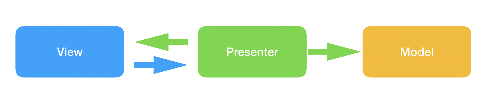
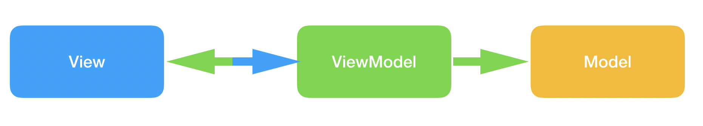
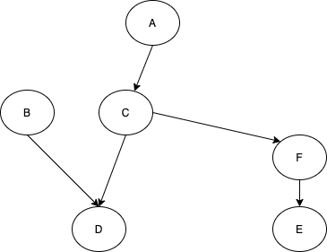

# Andorid Application Architecture

## Why new architecture

Android plantform is laterally using `MVC` as its original architecture,  Model-Layout XML-Acitivty/Fragment construts the basic ecosystem and it won't take too much time to make a simple app run on your android device. 

It's hard to say you couldn't build a fabulous app based on this route, but it is definitely a tough work to build an `easy to maintain`, `robust`, and `testable` app just following its basic components.

The outstanding problem is that `Acitivty/Fragment` is not a clean controller and coupled with view inside, it's handy to do a simple unit test for those logic because of the platform stuff, so the idea is to extract the logic part out, which becomes the main concept of the new architecture we are gonna discuss below.


## MVP (Model-View-Presenter)



The concept of mvp is to extract `Present` and `View` interface to split logic out of Activity/Fragment, make the view logic and business logic abstract, and all of the components become unit testable.

Basicly every Activity/Fragment has its own presenter and there is no communication between presenters, Activity/Fragment initializes and holds presenter and implements `View` interface, presenter holds `View` and `Model` and handle the logic between them.

```
interface Contract {
    interface Presenter {
        fun load()
    }
    interface View {
        fun render(data: String)
    }
}

class PresenterImp(val view: View, val repo: Repo): Presenter {
    override fun load() {
        repo.load() {
            view.render(it)
        }
    }
}

class MyActivity: Activity(), View {
    val presenter = PresenterImp(this, Repo())

    fun onCreate() {
        presenter.load()
    }

    override fun render(data: String) {
        txt.text = data
    }
}
```

Despite the benefits we could get from MVP, it also brings some side effects to our application.

As we know android platform has its own lifecycle, all of the operation should be within proper lifecycle, otherwise it will crash your app.

The fix for this side effect is to add more interface for presenter to be aware of the lifecycle or manually attatch and detach view (barely make view inside presenter optional).

Luckly google provides another architecture to make it more friendly with lifecyle handling.

## MVVM (Model-View-ViewModel)



As we see there is no big change between MVVM and MVP, the only change is `View` and `ViewModel` is binded together, rather than composition.

With the support of google, the only effort of `MVVM` becomes to implement your own `ViewModel` and `LiveData`, don't need to be warried about lifecycle.

```
class MyActivity: Activity(), LifeCycleOwner {
    val viewModel = MyViewModel(Repo())

    fun onCreate() {
        viewModel.result.observe(this, Observer{
            txt.text = it 
        })

        viewModel.load()
    }
}

class MyViewModel(val repo: Repo): ViewModel() {
    private val _result: MutableLiveData()
    val result: LiveData = _result

    fun load() {
        repo.load() {
            _result.value = it
        }
    }
}
```

## Clean architecture

```
           -------------------
          | Activity/Fragment |
           -------------------
                    |
                    V
            -----------------
            |   ViewModel   |
            |    ......     |
            |   Livedata    |
            -----------------
                    |
                    V
            -----------------
            |   Repository  |
            -----------------
                    |
                    V
        -------------------------
        |                       |
        V                       V
------------------        -------------------
| LocalDataSource|        | RemoteDataSource|
------------------        -------------------
```

## Homework

Check next sector

## Reference

[Google MVP sample](https://github.com/android/architecture-samples/tree/todo-mvp-kotlin)

[Google MVVM sample](https://github.com/android/architecture-samples/tree/todo-mvvm-live-kotlin)

[Google MVVM Archtecture](https://developer.android.com/jetpack/docs/guide)


===========================================================================================================

# Andorid Dependency Injection

## Why DI?
Dependency injection is a programing technique that  an object receives other objects that it depends on, it is well suited to Android development, and help us to create an asewsome app architecture.



Benefits we can gain from DI:

- Easy to test
- Esay to reuse
- Easy to refactor

## Basic

How can we implement a DI system in Android?

First we need to know what is needed for this system, as we know the aim is to lift up components/objects initialization and decouple from each other, then we should also take reuse into account.

Those are the points for a basic DI system on android platform.

- Inject components in Activity/Fragment/Service
- Support instance creatation on demand
- Support singleton
- Support scope

Detail please check master branch of the demo.

## Dagger

When we are talking about dagger, we always mean dagger2 for now.

Dagger is a fully static, compile-time dependency injection framework for both Java and Android. It is an adaptation of an earlier version created by Square and now maintained by Google.

Basic syntax

### @Inject lets Dagger know how to create instances of this object

```
class Presenter @Inject constructor(
    private val repo: Repo
) { ... }
```

```
class Repo @Inject constructor() { ... }
```

### @Component makes Dagger create a graph of dependencies

```
@Component
interface Graph {
    fun presenter(): Presenter
    fun repo(): Repo
    fun inject(activity: Activity)
}
```

### @Module All @Provides methods must belong to a module. @Module will supply @Component

```
@Module
class DataModule {
  @Provides
  fun providesDataSource(httpClient: HttpClient) = DataSource(httpClient)

  @Provides
  @Singleton
  fun providesDataSource() = HttpClient()
}

@Singleton
@Component(modules =[DataModule::class])
interface Graph {
    fun httpClient(): HttpClient
    fun inject(activity: Activity)
}
```

### @Subcomponent makes Dagger created a scoped graph of dependencies

```
@Subcomponent
interface SubGraph {
    ...
    fun inject(childActivity: Acitivity)
}

@Component
interface Graph {
    fun subGraphComponent(): SubGraphComponent
    fun inject(activity: Activity)
}
```

### How to use it

```
class MyApplication: Application() {
    val appComponent = GraphComponent.create()
}

class MyActivity: Activity() {
    @Inject lateinit var presenter : Presenter

    override fun onCreate() {
        //inject presenter
        (applicationContext as MyApplication).appComponent.inject(this)

        //get subcomponent
        (applicationContext as MyApplication).appComponent.subGraphComponent

        super.onCreate(savedInstanceState)
    }
}
```

## Koin

### module

```
module {

    single { HelloMessageData() }

    single { HelloServiceImpl(get()) as HelloService }

    factory { MySimplePresenter(get()) }
}
```

### startKoin

```
    //for kotlin
   startKoin {
        // use Koin logger
        printLogger()
        // declare modules
        modules(helloModule)
    }

    //for android
    startKoin {
        androidLogger()
        androidContext(this@MyApplication)
        modules(helloModule)
    }
```

### viewModel

```
module {
    // single instance of HelloRepository
    single<HelloRepository> { HelloRepositoryImpl() }
    // MyViewModel ViewModel
    viewModel { MyViewModel(get()) }
}

```

### scope

```
module {
    // declare a scope for DetailActivity
    scope<DetailActivity> {
        scoped<DetailContract.Presenter> { DetailPresenter(get) }
    }
}
```

### inject

```
    //delegate
    val firstPresenter: MySimplePresenter by inject()
    //get
    val presenter : MyPresenter = get()
    //viewmodel
    val model : MyViewModel by viewModel()
    //scope
    val presenter: DetailContract.Presenter by currentScope.inject()
```


## Homework

- Based on clean architecture
- Use Dagger or Koin to do injection
- load data from `https://api.adviceslip.com/advice`
- Show result in `TextView`
- Provide refresh function with a button, or SwipeRefreshLayout

Tips:
- Use [Retrofit](https://square.github.io/retrofit/) to fetch http server and parse json to object

## Reference

[Wiki Dependency Injection](https://en.wikipedia.org/wiki/Dependency_injection)

[Google DI intro](https://developer.android.com/training/dependency-injection)

[Dagger](https://dagger.dev/dev-guide/)

[Koin](https://start.insert-koin.io/#/introduction)