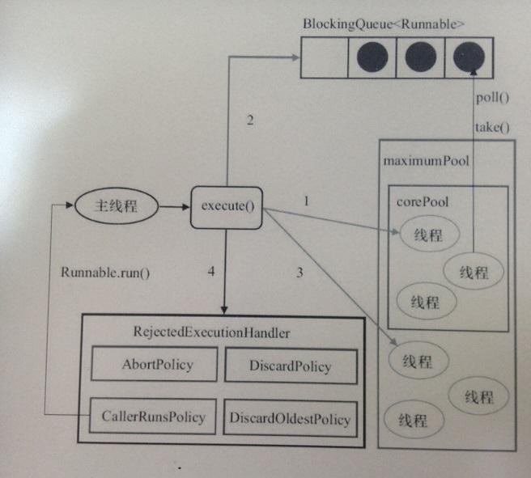

##### Thread and Message mechanism
## 0. Target
1. Thread
   1. Know some precautions of using thread in Android
   2. Better way to use thread in Android
2. Message mechanism
   1. The concepts and principles of Handler, Looper, MessageQueue
   2. The relationship between Handler, Looper and MessageQueue
   3. How to use them
## 1. Thread

Android use Java thread mode, you can use thread as in Java, but there are some points are needed to notice.
### 1.1 Main Thread
The official website explain what is the main thread:
>When an application is launched, the system creates a thread of execution for the application, called "main." This thread is very important because it is in charge of dispatching events to the appropriate user interface widgets, including drawing events. It is also almost always the thread in which your application interacts with components from the Android UI toolkit (components from the android.widget and android.view packages). As such, the main thread is also sometimes called the **UI thread**. 

Ref: [Processes and threads overview#Threads](https://developer.android.com/guide/components/processes-and-threads#Threads)  

From the introduce, we can know main thread is:

1. where UI drawing, including the system provided UI toolkit and your custom view.
2. where user interacting events dispatching, e.g touch event.
3. where lifecycle methods run.

For the user experience, main thread must keep unblock, you can never do any time-consuming operations in main thread like:
- reading and writing files.
- doing database operations.
- accessing network.
- waiting locks.
- doing time-consuming thing in onDraw method of your custom view, like parsing image and create object
- doing RPC

You can use strick mode in developer tools to find main thread lag problems
### 1.2 Use thread in Android
#### 1.2.1 Normal usage
You can use Thread in Android as it in Java:
```java
Thread thread = new Thread(){
   @Override
   public void run() {
         //Do some works
   }
};
thread.setPriority(android.os.Process.THREAD_PRIORITY_DEFAULT); // not necessary
thread.start();
```
In kotlin:
```kotlin
thread(start = true, priority = android.os.Process.THREAD_PRIORITY_DEFAULT /* not necessary */) {
   //Do some works
}
```
##### Thread Priority

On above, we can see I set the priority for the thread, the priority is about the schedule of the thread, in Android, the range of priority is `[-19, 19]`, the `-19` is the highest priority in Android, and normal Application in Android can just use the range `[-1, 19]`. The default priority of a new created thread is as the same as their parent thread, and the system will set the priority of main thread of the foreground App to `-2`, means the child thread you create in your main thread will have the same schedule opportunity as the main thread, so it may interrupt the main thread and render thread, so you should always set your thread's priority.

And there are some different in Kotlin, in the Kotlin example above, we use a function creating a thread, but not a class as in Java, in the `thread()` function, it set the default priority to `-1`, but not as same as parent.

##### Other concurrent Class

You can also use another concurrent class like FutureTask and so on.  

##### Attention

- Don't use thread by this way, you will lose control of the thread
- Don't do long term work in thread like download files, may cause leak

#### 1.2.2 AsyncTask
<font color=red>**This API is deprecated in Android R**</font> 

An asynchronous task is defined by a computation that runs on a background thread and whose result is published on the UI thread.

Basic usage:

```kotlin
class MainActivity : AppCompatActivity() {

    override fun onCreate(savedInstanceState: Bundle?) {
        super.onCreate(savedInstanceState)
        setContentView(R.layout.activity_main)
      
      	//Initialize and execute
        DownloadFilesTask().execute("url1", "url2", "url3")
    }

  	//Define
    inner class DownloadFilesTask : AsyncTask<String, Int, Long>() {
      
        override fun onPreExecute() {
            //Do some preparation in UI thread before working
        }
      
        override fun doInBackground(vararg urls: String): Long {
            val count = urls.size
            var totalSize: Long = 0
            for (i in 0 until count) {
                totalSize += Downloader.downloadFile(urls[i])
                publishProgress((i / count.toFloat() * 100).toInt())
                // Escape early if cancel() is called
                if (isCancelled) break
            }
            return totalSize
        }

        override fun onProgressUpdate(vararg values: Int?) {
            values[0]?.apply {
                setProgressPercent(this)
            }
        }

        override fun onPostExecute(result: Long) {
            showDialog("Downloaded $result bytes")
        }
      
        override fun onCancelled(result: Long?) {

        }
    }


    fun setProgressPercent(progressInPercent: Int) {
        //Update content
    }

    fun showDialog(str: String) {
        //Show Dialog
    }
}
```

Want get more details see: [AsyncTask](https://developer.android.com/reference/android/os/AsyncTask)

##### Cautious

1. AsyncTask uses a single pool thread to run all the tasks of its process by default, means the tasks are executed sequencely, so you shouldn't run long period of time tasks in AsyncTask, it will block later tasks
2. Don't submit too many tasks to AsyncTask in a short time, it may trigger the `RejectedExecutionHandler` on some old Android versions.
3. AsyncTask is disposable item, you can't execute it twice.
4. Beware of memory leak

#### 1.2.3 ThreadPool

##### How ThreadPool works?



From: [Java线程池ThreadPoolExecutor详解](http://www.crazyant.net/2124.html)

#### 1.2.4 Other way to replace using thread
- RxJava
- Kotlin coroutine

## 2. Message mechanism(Handler mechanism)

### 2.1 What Message mechanism is.

Message mechanism provides a way to send and process message or action between threads. 

It Contains 4 classes:

- Handler: A class that can be used to send and process Message or action associated with a thread's MessageQueue, a thread can associate with many handler.
- Looper: Class used to run a message loop for a thread, Looper belongs with thread.
- MessageQueue: Low-level class holding the list of messages to be dispatched by a Looper.
- Message: Defines a message containing a description and arbitrary data object that can be sent to a Handler.


From: [Android消息机制1-Handler(Java层)](http://gityuan.com/2015/12/26/handler-message-framework/)

### 2.2 How to use it

#### 2.2.1 Handler

Handler can either send and process a message or an action to execute to its associated thread which contains a Looper, then it will process the message or run the action in the associated thread, you must point out which looper it uses when constructing it.

There are 2 most popular usages of Handler:

1. Post an action to a thread to run
2. Overriden `handleMessage()`function and define various message type, do different work when receive different message

##### Create a Handler

```kotlin
// Create a handler of current thread, if current thread does'nt contain Looper, it throws an Exception
val handler = new Handler() 

// Create a handler of Main thread
val handlerOfMain = new Handler(Looper.getMainLooper())

// Create a handler with callback
val handlerWithCallback = Handler(Handler.Callback { msg ->
    //Do some thing with msg
    return@Callback true
})

//Create a custom handler with override handleMessage method, don't do this in main thread
val customHandler: Handler = object : Handler() {
  override fun handleMessage(msg: Message) {
    when (msg.what) {
      DOWNLOAD_START -> {
      }
      DOWNLOAD_PROGRESS -> {
      }
      DOWNLOAD_FINISHED -> {}
      else -> {}
    }
  }
}

//Safe way to create a handler associated with an activity
class CustomHandler(mainActivity: MainActivity) :
    Handler(Looper.getMainLooper()) {
    private val weakRef: WeakReference<MainActivity> = WeakReference(mainActivity)

    override fun handleMessage(msg: Message) {
      	val activity = weakRef.get()
        if (activity == null || activity.isDestroyed) return
        
          when (msg.what) {
            DOWNLOAD_START -> {
              activity.onDownloadStart()
            }
            DOWNLOAD_PROGRESS -> {
            }
            DOWNLOAD_FINISHED -> {}
            else -> {}
          }
    }
}
```

##### Create a Message

```kotlin
//with constructor, don't do this
val msg = Message().run { 
  what = DOWNLOAD_PROGRESS
  arg1 = 1000
  arg2 = 1
  obj = "download failed"
  target = handler
}

//Alway create a message like this:
val msg = Message.obtain(handler, DOWNLOAD_PROGRESS)
// message with callback
val msgWithCallback = Message.obtain(handler, Runnable {  })
//can replace last parameter with lambda
val msgWithCallback = Message.obtain(handler, {  })
//or
val msgWithCallback = Message.obtain(handler){}

//Or this way, this is a wrapping of the above one
handler.obtainMessage(handler, DOWNLOAD_PROGRESS)
```

##### Send a message to a MessageQueue

You can only send a message to a Message Queue via a Handler

```kotlin
//send message without create it
handler.sendEmptyMessage(DOWNLOAD_PROGRESS)

//send message delay
handler.sendMessageDelayed(msg, 1000)

//send message at time
handler.sendMessageAtTime(msg, SystemClock.uptimeMillis() + 1000)

//Don't use this unless you know what it do and you really need use it
handler.sendMessageAtFrontOfQueue(msg)

//post an action to thead to execute
handler.post(Runnable {  })

//post an action at time
handler.postAtTime(Runnable {  }, SystemClock.uptimeMillis() +1000)

//post an action delay
handler.postDelayed(Runnable {  }, 1000)

//implement a corase timer without other class
handler.postDelayed(object : Runnable {
  override fun run() {
    //Do some thing
    handler.postDelayed(this, 1000)
  }
}, 1000)

//Don't use this unless you know what it do and you really need use it
handler.postAtFrontOfQueue(Runnable {  })
```

##### Remove callback and messages

```kotlin
handler.removeMessages(DOWNLOAD_PROGRESS)

handler.removeCallbacks(aCallback)

//This is useful when close a thread with Looper
handler.removeCallbacksAndMessages(null)
```


There are some wrapping functions for posting message or action to main thread:

```kotlin
//this can send an action to UI thread
activity.runOnUiThread{
  //Do something
}

//The following three example must use a view which has attached to a context
view.post{ 
	//Do something
}

view.postDelay({
  //Do something
}, 1000)

//implement a corase timer
view.postDelayed(object : Runnable {
  override fun run() {
    //Do some thing
    view.postDelayed(this, 1000)
  }
}, 1000)
```

##### How Handler deal with message and action

```java
public class Handler {  
    public void dispatchMessage(@NonNull Message msg) {
      if (msg.callback != null) {
        handleCallback(msg);
      } else {
        if (mCallback != null) {
          if (mCallback.handleMessage(msg)) {
            return;
          }
        }
        handleMessage(msg);
      }
    }

    private static void handleCallback(Message message) {
        message.callback.run();
    }
  
}
```

1. If a message contains a callback, handler just run its callback.
2. If you give a callback as a paramater when constructoring handler, handler uses this callback to process messages, if the callback return true, process finish, orelse go to step 3.
3.  If you didn't give a callback when constructing handle, it handle the message using `handleMessage()`function.

#### 2.2.2 Looper

In above section, we say a handler must associate with a Thread which has a Looper, so how to create a Looper for a Thread, a simple example is as below:

```kotlin
class LooperThread : Thread() {
    var mHandler: Handler? = null
    override fun run() {
        Looper.prepare()
        mHandler = object : Handler() {
            override fun handleMessage(msg: Message?) {
                // process incoming messages here
            }
        }
        Looper.loop()
    }
}
```

So there are 3 point:

1. At first, you must call `Looper.prepare()`to create a looper for the thread instead of construct it directly
2. Use the no parameter constructor of handler to use the looper of the thread by default, but you shouldn't do it at this way
3. Start looper by calling `Looper.loop()`, this function will block the thread from exiting and start a message looping.

##### Usage

```kotlin
//Get Main Looper
Looper.getMainLooper()

//Get current thread's looper
Looper.myLooper()

//Quit the looper of current thread immediately without processing any more messages in the message queue
Looper.quit()

//Quit the looper of current thread after all the messages in the queue processing finished
Looper.quitSafity()
```

##### HandlerThread

If you want to create a looper in a thread, you don't need to do it manually, Android provides a wrapping class called `HandlerThread`:

```kotlin
val handlerThread = HandlerThread("HandlerThread")
handlerThread.start()
val threadHandler = Handler(handlerTHread.Looper)
threadHandler.post{
  //some work need to do in thread
}
```

#### 2.2.3 MessageQueue

MessageQueue is a low-level class holding the list of messages to be dispatched by a Looper, we cannot enqueue or remove message directly to MessageQueue, but should use hander to do, one useful function for user is the `IdleHandler`, it can define some tasks need to do when the thread is idle, some times, there are some work should be done in a specific thread, but it is not so urgent and must not execute at the time the thread is busy to keep from block the thread, at this time, we can add an `IdleHandler`to this MessageQueue of the thread:

```kotlin
//Add IdleHandler to a MessageQueue
Looper.getMainLooper().queue.addIdleHandler(MessageQueue.IdleHandler { return@IdleHandler true })
//You can remove an IdleHandler explicitly
Looper.getMainLooper().queue.removeIdleHandler(idleHandler)
```

If return false, the `IdleHandler` will be removed atomically after executed, if return true, it will run at every idle.

### 2.3 How it works


From: [Android消息机制1-Handler(Java层)](http://gityuan.com/2015/12/26/handler-message-framework/)

1. Once you create a Looper in a thread, it starts a endless loop.
2. In the endless loop, the Looper tries to dequeue a message from the MessageQueue.
3. If the MessageQueue is empty, **the dequeue action will block the thread and wait for a message**.
4. Once you send a message to the thread's MessageQueue through a handler, the blocking thread will be awaked by the native looper and dequeue the message, then process the message by calling the message's callback or the associated handler's callback or handleMessage function.
5. When all Messages in MessageQueue are processed, means the MessageQueue is empty, then go to step2

**A high frequency interview Question**: Why the endless looper in Main thread donesn't cause the ANR?

# HomeWork

Implement a ImageLoader using a HandlerThread

1. Define a HandlerThread as a work thread to download image from network(you can just replace download with sleep)

2. Main thread sends a url list to work thread with handler.

3. Work thread then downloads images in background, when an image downloading is finished(success or failed), work thread must notify the main thread, and main thread then shows the download result.

4. There is a stop button and a restart button to stop and restart the download work

5. When the activity exit, you must stop work thread.

6. Avoid memory leak